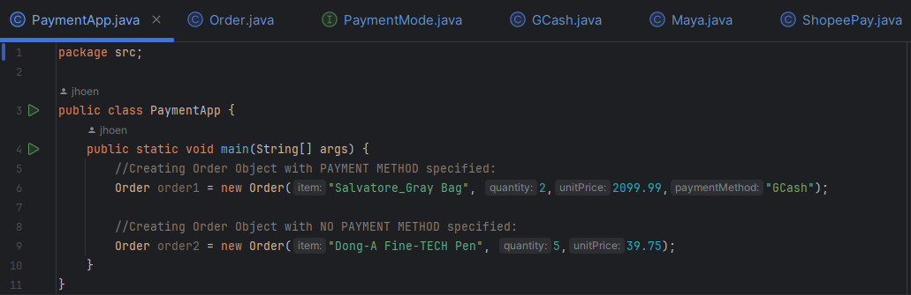
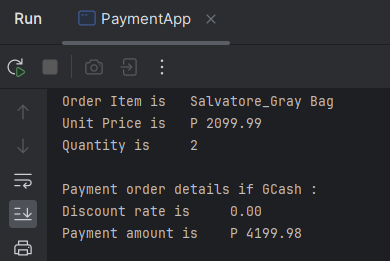
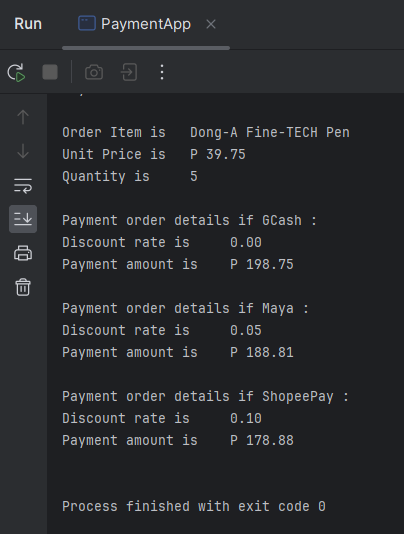

# PaymentMode - Object Oriented Programming
 

## Description
📝 **A simple java program that demonstrates the concept of **inheritance** with the use of interface `Payment Mode` to create classes that are of specific modes of Payment: `GCash`, `Maya`, `ShopeePay`.**  

✏️ *Note*: This project is a seatwork for my OOP subject. I was instructed to make a simple program out of a given uml sequence diagram. I added two contructors: one for when user specifies a Payment Method, two for when user doesn't specify a Payment Method. 

---

## This Contains
📁 ./src/  
- `PaymentApp.java` : Contains the main method of the project. Instantiates an example of an `Order` object.
- `Order.java` : Has two constructors (one including PaymentMethod, two not including PaymentMethod)
- `PaymentMode.java` : An interface for specific payment methods.
- `GCash.java` : implements `PaymentMode`
- `Maya.java` : implements `PaymentMode`
- `ShopeePay.java` : implements `PaymentMode`

---

## Screenshots
### 💾 Main Method 

  

### 💾 Output 1 (Payment Method is specified) 

  

### 💾 Output 2 (Payment Method is not specified) 

  

